<picture><source media="(prefers-color-scheme: dark)" srcset="./pingus-dark.svg"></picture>

**Hi there! 👋**

I am a software engineering researcher with an interest in modeling and reasoning about software variability.
I am currently a research assistant and PhD student at the University of Magdeburg in Germany.
Find my projects below or [contact me](mailto:kuiter@ovgu.de).

**[About Me](https://www.dbse.ovgu.de/Mitarbeiter/Elias+Kuiter.html)
– [Google Scholar](https://scholar.google.de/citations?user=iEVEpeIAAAAJ)
– [dblp](https://dblp.uni-trier.de/pid/226/7719.html)
– [ResearchGate](https://www.researchgate.net/profile/Elias_Kuiter)
– [ORCID](https://orcid.org/0000-0003-0429-2461)
– [ACM](https://dl.acm.org/profile/99659308621)
– [Researchr](https://conf.researchr.org/profile/eliaskuiter)
– [Web of Science](https://www.webofscience.com/wos/author/record/IAN-0538-2023)
– [Forschungsportal](https://forschung-sachsen-anhalt.de/pl/kuiter-117313)
– [Twitter](https://twitter.com/ekuiter)**

  
<strong><a href="https://elias-kuiter.de/publications.php">Publications</a></strong>

  
A list of all my publications is available <a href="https://elias-kuiter.de/publications.php">here</a>.

  
<strong>Slides</strong>

  <table>
  <tr>
  <td></td>
  <td></td>
  </tr><tr>
  <td><a href="https://raw.githubusercontent.com/SoftVarE-Group/Slides/main/2024/2024-04-10-FOSD-Linux.pdf">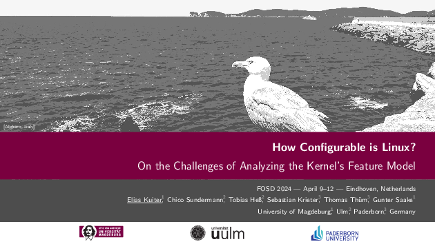</a></td>
  <td><a href="https://raw.githubusercontent.com/SoftVarE-Group/Slides/main/2024/2024-02-07-VaMoS-FM-Complexity.pdf">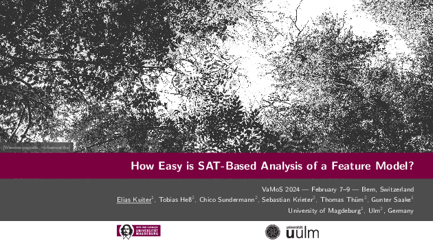</a></td>
  </tr><tr>
  <td><a href="https://raw.githubusercontent.com/SoftVarE-Group/Slides/main/2023/2023-07-04-SAT-Tseitin.pdf">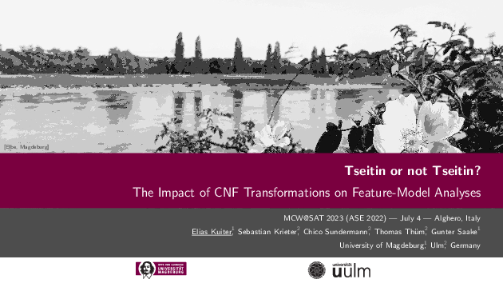</a></td>
  <td><a href="https://raw.githubusercontent.com/SoftVarE-Group/Slides/main/2023/2023-02-22-SE-Tseitin.pdf">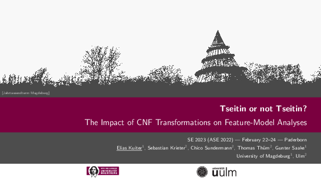</a></td>
  </tr><tr>
  <td><a href="https://raw.githubusercontent.com/ekuiter/variED-meta/master/se23-slides.pdf">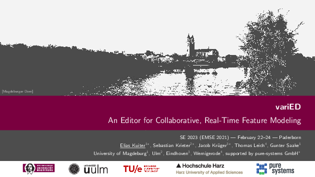</a></td>
  <td><a href="https://raw.githubusercontent.com/SoftVarE-Group/Slides/main/2022/2022-10-13-ASE-Tseitin.pdf">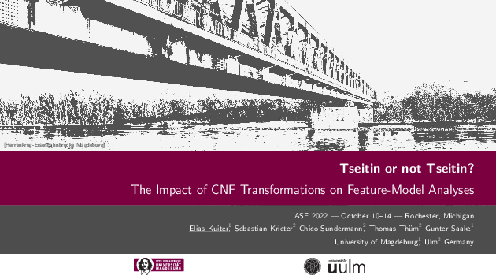</a></td>
  </tr><tr>
  <td><a href="https://raw.githubusercontent.com/SoftVarE-Group/Slides/main/2022/2022-03-31-FOSD-Tseitin.pdf">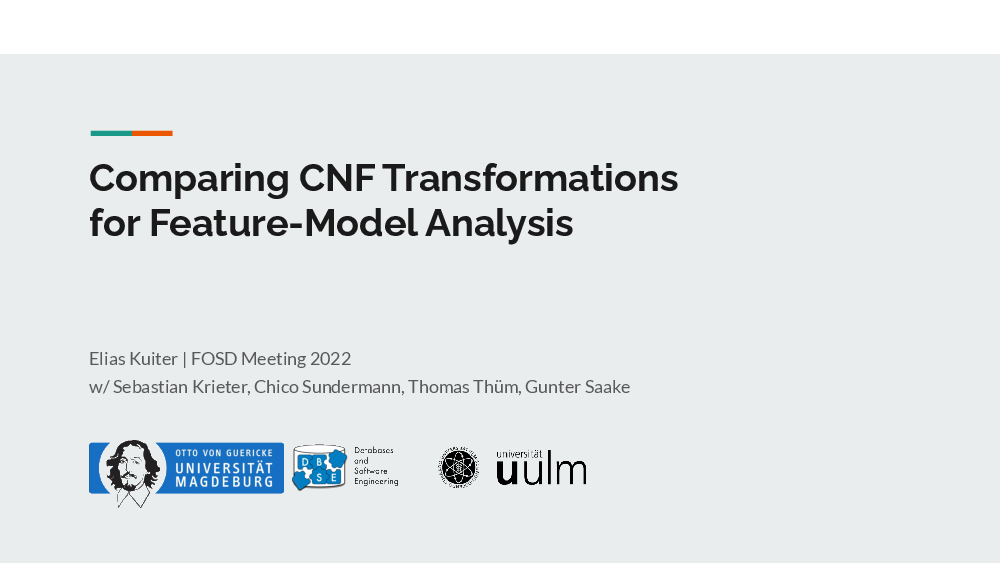</a></td>
  <td><a href="https://raw.githubusercontent.com/ekuiter/KeYPl/master/VaMoS 2022 Presentation.pdf">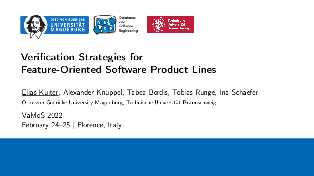</a></td>
  </tr><tr>
  <td><a href="https://raw.githubusercontent.com/ekuiter/pignap-case-study/master/SPLC 2021 Presentation.pdf">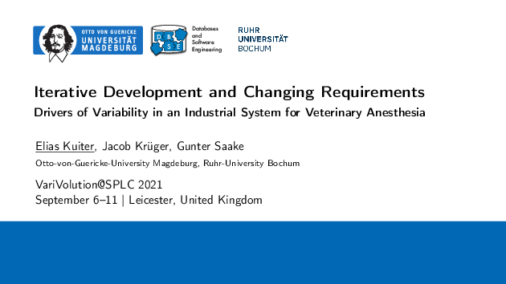</a></td>
  <td><a href="https://raw.githubusercontent.com/ekuiter/KeYPR/master/2021-01-08-Master-Thesis-Defense.pdf">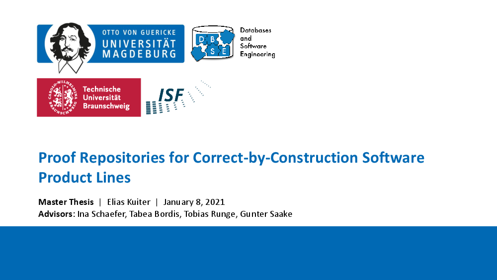</a></td>
  </tr><tr>
  <td></td>
  <td><a href="https://raw.githubusercontent.com/ekuiter/variED-meta/master/thesis-slides.pdf">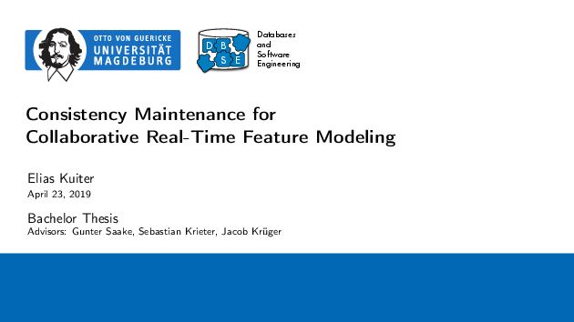</a></td>
  </tr><tr>
  <td><a href="https://raw.githubusercontent.com/ekuiter/variED-meta/master/fosd19-slides.pdf">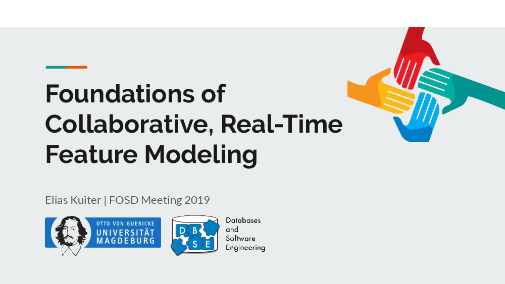</a></td>
  <td><a href="https://raw.githubusercontent.com/ekuiter/PCLocator/master/splc18-pclocator-slides.pdf">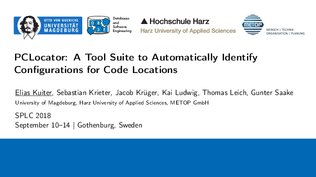</a></td>
  </tr><tr>
  <td><a href="https://raw.githubusercontent.com/ekuiter/uvr2web-spl/master/2018-09-12-SPLC-Getting-Rid.pdf">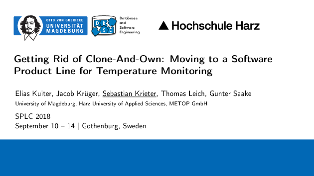</a></td>
  </tr>
  </table>

  
<strong>Lectures</strong>

  - [**Course on Software Product Lines**](https://github.com/SoftVarE-Group/Course-on-Software-Product-Lines) (2023)
    <table>
    <tr>
    <td><a href="https://raw.githubusercontent.com/SoftVarE-Group/Slides-of-the-SPL-Course/main/2023st/04-modeling.pdf"><picture><source media="(prefers-color-scheme: dark)" srcset="./thumbnails/04-modeling-dark.png">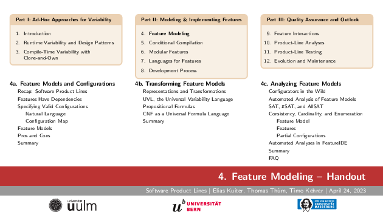</picture></a></td>
    <td><a href="https://raw.githubusercontent.com/SoftVarE-Group/Slides-of-the-SPL-Course/main/2023st/10-analyses.pdf"><picture><source media="(prefers-color-scheme: dark)" srcset="./thumbnails/10-analyses-dark.png">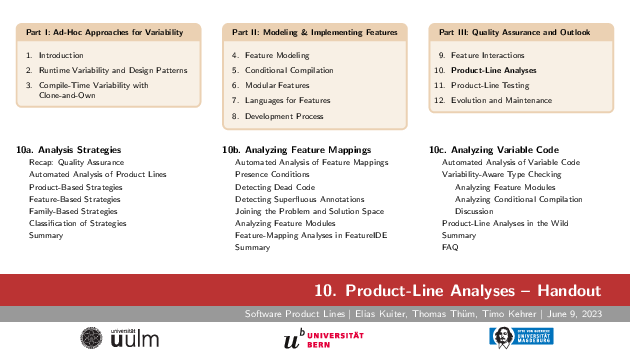</picture></a>
    </td>
    </tr>
    </table>
  
    - [SPL04a Feature Models and Configurations](https://www.youtube.com/watch?v=WbhaXgkFLH4&list=PL4hJhdKDPIxha8So7muX2zfNUU8NBoiu3&index=11)
    - [SPL04b Transforming Feature Models](https://www.youtube.com/watch?v=KJ620XysK28&list=PL4hJhdKDPIxha8So7muX2zfNUU8NBoiu3&index=12)
    - [SPL04c Analyzing Feature Models](https://www.youtube.com/watch?v=OpSaA1Nt56w&list=PL4hJhdKDPIxha8So7muX2zfNUU8NBoiu3&index=13)
    - [SPL10a Analysis Strategies](https://www.youtube.com/watch?v=W_PtKtG4MTo&list=PL4hJhdKDPIxha8So7muX2zfNUU8NBoiu3&index=29)
    - [SPL10b Analyzing Feature Mappings](https://www.youtube.com/watch?v=lfnsBacENHU&list=PL4hJhdKDPIxha8So7muX2zfNUU8NBoiu3&index=30)
    - [SPL10c Analyzing Variable Code](https://www.youtube.com/watch?v=ICb1xShuicY&list=PL4hJhdKDPIxha8So7muX2zfNUU8NBoiu3&index=31)

  
<strong><a href="https://raw.githubusercontent.com/ekuiter/ekuiter/main/thesis-topics.pdf">Thesis Topics</a></strong>

  
An overview of my thesis topics and software projects is available <a href="https://raw.githubusercontent.com/ekuiter/ekuiter/main/thesis-topics.pdf">here</a>.

  
<strong>Statistics</strong>

  <picture>
    <source media="(prefers-color-scheme: dark)" srcset="https://github-readme-stats.vercel.app/api?username=ekuiter&count_private=true&show_icons=true&hide_title=true&hide_rank=true&theme=dracula">
    
  </picture>
  
  

